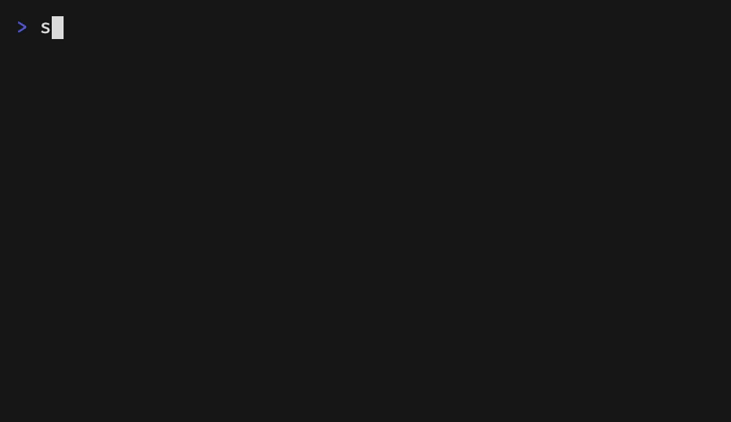

# swoop

Say it like a bird does: swoop down, grab the thing, gone.

An open-source keyboard launcher built the Unix way: fzf does
the finding, libghostty does the drawing, and every extension is a program
that prints lines.

Early days, but it installs in one line: see [Install](#install).

## Try it in any terminal

Without the frame, swoop is still a terminal program. You need Go and fzf.
Then:

```sh
make build        # compiles the tools into bin/
bin/swoop         # lists your apps; type to filter; Enter opens; Esc quits
```

It runs in any terminal. Icons and previews are pictures in a terminal that
draws them (Ghostty, kitty, WezTerm, Konsole) and glyphs and text anywhere
else; `SWOOP_PICTURES=1` or `0` overrides the guess. The frame above is the
launcher; this is the same program without it, which is also how you run it
on Linux or Windows, or
inside Ghostty's own quick terminal if you prefer that to the frame. For the
quick terminal, add to your Ghostty config:

```
keybind = global:alt+space=toggle_quick_terminal
quick-terminal-position = center
```

reload it with `cmd+shift+,`, grant Ghostty Accessibility access when it
asks, and add to the end of your `~/.zshrc`, with the path to your checkout:

```sh
# Ghostty sets this in its quick terminal and nowhere else.
if [[ -n "$GHOSTTY_QUICK_TERMINAL" ]] && [[ -x /absolute/path/to/swoop/bin/swoop ]]; then
  exec /absolute/path/to/swoop/bin/swoop
fi
```

Take those lines out again to get a plain quick terminal back.



The plan, every design decision, and the work in progress live in the
[issues](https://github.com/beatzball/swoop/issues). Start there.

## Install

```sh
curl -fsSL https://raw.githubusercontent.com/beatzball/swoop/main/scripts/get | bash
```

No Go, no Xcode tools, no fzf needed. It downloads the release for your OS
and arch into `~/.local/share/swoop/<version>`, links
`~/.local/share/swoop/current` to it, and fetches fzf into the same place if
fzf is not on your PATH. On a Mac it also writes two launchd agents that run
at login: the frame, which owns the hotkey and the panel, and the clipboard
watcher. Press alt+shift+space. On Linux and Windows there is no frame yet;
it tells you how to run `swoop` in a terminal.

`| bash -s -- --version 0.4.0` installs a given release instead of the
latest. Run it again to upgrade. Logs are in `~/Library/Logs/swoop`, and
`~/.local/share/swoop/current/scripts/uninstall` removes the agents and keeps
your history.

### From a checkout

```sh
git clone https://github.com/beatzball/swoop.git && cd swoop && make install
```

The same two agents, pointed at the checkout. You need Go, fzf, and Xcode's
tools. `make install` again after a pull restarts them on the new build;
`make uninstall` removes them and keeps your history.

## The macOS frame

The frame is a small Swift program, `shell/mac`, that does nothing but show
a floating panel with swoop in it, drawn by libghostty, on a global hotkey.
`make install` runs it for you; to run it by hand instead:

```sh
make build shell-mac
PATH="$PWD/bin:$PATH" shell/mac/.build/release/swoop-shell-mac
```

Then press alt+shift+space. Esc closes it, Enter opens what you picked, a
click elsewhere hides it, and the next press is a fresh launcher with an
empty bar. `SWOOP_HOTKEY=alt+space` picks another key; `SWOOP_LAUNCHER`
points at a different `swoop`. It needs no Ghostty.app and no permission.

cmd+[ and cmd+] move the divider between the list and the preview, 5% a
step, and the width is remembered in `~/.config/swoop/config` (`preview =
58`). In a plain terminal the keys are alt+left and alt+right. Drag any
edge of the panel to resize it; the size is remembered in
`~/.config/swoop/shell-mac.json` beside the font size, and can be typed
there too (`width`, `height`). A bird in the menu bar opens the launcher,
opens the settings folder, and quits; `SWOOP_NO_MENU_BAR=1` leaves it
out.

## Ask AI

Press Tab from anywhere. The pane opens with whatever you had typed still
in the bar. Enter sends it, the bar clears, and the answer arrives on the
right: your prompt, dots while the model thinks, then the text as it comes.
Type again and press Enter to continue the same conversation; each exchange
appends below the last. The list under `Ask AI >` holds your conversations,
newest first; move to one to read it, and ctrl-k on it offers Copy last
answer, Copy conversation, and Delete. Esc brings the launcher back with
the text you had before Tab.

swoop does not know what a model is. It runs one command with the
conversation so far on its stdin and shows what comes out of its stdout, as
it comes. Name the command in `~/.config/swoop/ai`, one line:

```
ollama run llama3.2
```

Without that file it uses `claude -p` if `claude` is on your PATH (streamed
through `jq` when that is there too, and allowed to search and fetch the
web, which only reads), then `ollama run` with the first model `ollama
list` shows. Anything that reads a question and prints an answer
works, streaming or not. Conversations are files in
`~/.local/state/swoop/ai`, readable by you only.

Answers are markdown, drawn by swoop's own small renderer. It is also a
command, `swoop-md`, for anything else that wants markdown in a terminal:

```sh
printf '# hi\n\n- one\n- two\n' | swoop-md -w 40
```

And the transcript can be drawn by any command instead. One line in
`~/.config/swoop/config`, the answer on its stdin, its stdout shown:

```
render = glow -s dark
```

## What runs when the launcher is closed

One thing: `swoop-clipd`, the clipboard watcher. The launcher starts it the
first time and it keeps running, polling the clipboard a few times a second
and appending new text to `~/.local/share/swoop/clipboard/history.jsonl`,
readable by you only. Two things it never keeps: a copy that carries the
"concealed" mark some password managers set, and a copy made while an app on
the ignore list is in front. The list defaults to the known password managers;
write your own, one bundle id per line, at `~/.config/swoop/clipboard.ignore`.
Copy a password from your manager and run `bin/swoop-clipd types` to see what
it marks, and `osascript -e 'id of app "Its Name"'` to get its bundle id.

If a manager still gets through, start the watcher with `SWOOP_CLIPD_DEBUG=1`
and read `watcher.log` next to the history: each change is logged with the app
in front and the marks seen, never the text.

`swoop-clipd status` says whether it is running; `swoop-clipd delete <id>` and
`swoop-clipd clear` remove entries; kill it if you would rather it did not run.

## Write an extension

An extension is a folder with one program in it, named the same:

```
~/.config/swoop/extensions/hello/hello
```

The program answers four commands. Each is one run, then exit:

```
hello list                 # print one line per result
hello preview <id>         # print the right-hand pane for one result
hello run <id> [action]    # do it; the action is one of yours, from below
hello view <id> [query]    # print the rows of a pane, for a row of kind "view"
hello actions <id>         # optional: what ctrl-k offers on that row
```

An action row's id is the action's name, and its kind says what happens
after: `action` closes the launcher, `refresh` runs it and comes back to
the list, reloaded. Clipboard History's Delete is a `refresh`.

A row of kind `view` opens a pane instead of running: the launcher asks
`view` for its rows, again on every keystroke, and shows exactly what comes
back. `extensions/define/define` is one: Enter on "Define Word" and you are
typing into the dictionary.

A result line is five fields separated by tabs. Only the last three are shown:

```
id	kind	icon	title	subtitle
```

That is the whole contract. A shell script is enough; `extensions/system/system`
in this repository is one, and it is what puts Sleep and Lock Screen in the
list. Any language works, as long as it starts fast: `list` runs when the
launcher opens and `preview` on every cursor move.

## License

[MIT](LICENSE)
